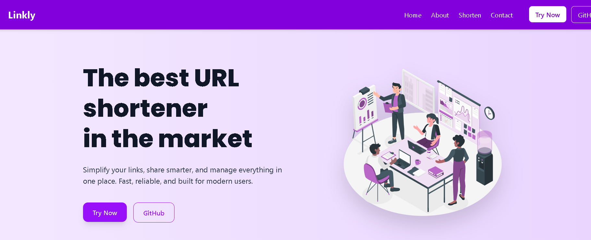
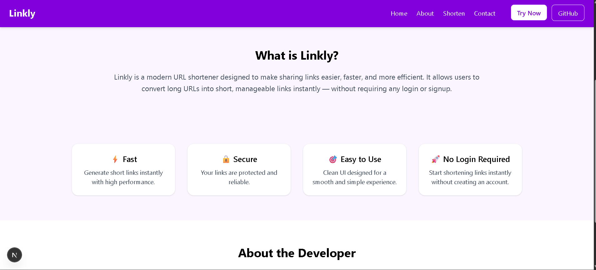

# 🚀 URL Shortener

[](https://github.com/your-username/your-repo/stargazers)
[](https://github.com/Rani704/Linkly/issues)
[](LICENSE)

A simple and modern **URL shortener** built with **Next.js** and **React**, allowing users to generate custom short links easily.

---

## 🌟 Features

- Shorten long URLs with a single click  
- Custom short URL option  
- Copy link to clipboard easily  
- Responsive and modern UI  
- Built with Next.js, React, and Tailwind CSS  

---

## 📸 Screenshots

**Homepage / Input Form**  
  

**About Section**  
  

---

## 🛠️ How to Use

1. Clone the repository:  
```bash
git clone https://github.com/Rani704/Linkly.git
